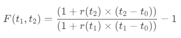

# Asset Classes - Mathematics
Let’s dive into the detailed mathematics and statistics involved in trading each of the asset categories, including necessary formulas and proofs where relevant.

### 1) **Foreign Exchange (FX)**

#### **Key Concepts:**
1. **Exchange Rates**:
   - **Definition**: The price of one currency in terms of another. If $E_{USD/EUR}$ represents the exchange rate from USD to EUR, then $1 \, USD = E_{USD/EUR} \times \text{EUR}$.
   - **Formula**: $$E_{USD/EUR} = \frac{1}{E_{EUR/USD}}$$.

2. **Interest Rate Parity (IRP)**:
   - **Concept**: IRP states that the difference between the forward exchange rate $F$ and the spot exchange rate $S$ is a function of the interest rate differential between two currencies.
   - **Formula**:
   $$
   \frac{F}{S} = \frac{1 + r_d}{1 + r_f}
   $$
   , where $r_d$ and $r_f$ are the domestic and foreign interest rates, respectively.

   **Proof**:
   Let’s consider two investment strategies:
   - **Strategy 1**: Invest $1$ unit of domestic currency at the domestic interest rate $r_d$.
   - **Strategy 2**: Convert $1$ unit of domestic currency to foreign currency at the spot rate $S$, invest it at the foreign interest rate $r_f$, and convert it back to domestic currency at the forward rate $F$.

   Equating the final returns from both strategies gives the IRP formula above.

3. **Volatility**:
   - **GARCH Model**: The Generalized Autoregressive Conditional Heteroskedasticity (GARCH) model is used to model and forecast time-series volatility, which is crucial in FX trading.
   - **Formula**: 
     
     

     where $\sigma_t^2$ is the conditional variance, $\epsilon_t$ are past residuals, and $\alpha_0, \alpha_i, \beta_j$ are model parameters.

#### **Additional Mathematical Tools:**
- **Stochastic Calculus**:
   - **Itô’s Lemma**: If $X_t$ follows a stochastic process 
   $$
   dX_t = \mu_t dt + \sigma_t dW_t
   $$
   , then for a function $f(X_t, t)$:
     
     

   - This is particularly used in deriving option pricing formulas in FX markets.

### 2) **Equities**

#### **Key Concepts:**
1. **CAPM (Capital Asset Pricing Model)**:
   - **Formula**: 
     
     
     
     where $E(R_i)$ is the expected return of asset $i$, $R_f$ is the risk-free rate, $\beta_i$ is the asset’s beta, and $E(R_m)$ is the expected market return.
   
   **Proof**:
   - Derived from the equilibrium conditions of the market where the expected return of an asset is proportional to its beta with respect to the market portfolio.

2. **Dividend Discount Model (DDM)**:
   - **Formula**: 
     
     
     
     where $P_0$ is the present stock price, $D_1$ is the dividend next period, $r$ is the required rate of return, and $g$ is the growth rate of dividends.
   
   **Proof**:
   - Based on the present value of a perpetuity with growth, where dividends are assumed to grow at a constant rate $g$.

#### **Mathematical Tools:**
- **Regression Analysis**:
   - Used to estimate the beta of a stock by regressing the stock’s returns against market returns:
     
     
     
     where $R_i$ is the return of stock $i$, $R_m$ is the market return, and $\epsilon$ is the error term.

- **Black-Scholes Model for Options**:
   - **Formula**: 
     
     
     
     where
     
     ,
     
     ,
     
     $S_0$ is the current stock price, $X$ is the strike price, $r$ is the risk-free rate, $\sigma$ is the volatility, and $N(d)$ is the cumulative distribution function of the standard normal distribution.

### 3) **Futures**

#### **Key Concepts:**
1. **Cost of Carry Model**:
   - **Formula**: 
     
     

     where $F$ is the futures price, $S$ is the spot price, $r$ is the risk-free rate, $c$ is the storage cost, $y$ is the yield on the asset, and $t$ is the time to maturity.
   
   **Proof**:
   - Based on the idea that the cost of carrying an asset forward should equal the futures price minus the spot price, accounting for the time value of money, storage costs, and yields.

2. **Basis and Hedging**:
   - **Basis**: 
     
     

   - The basis represents the difference between the spot price and the futures price, and it’s critical in hedging strategies to assess the effectiveness of a hedge.

#### **Mathematical Tools:**
- **Value at Risk (VaR)**:
   - **Formula**: 
     
     
     
     where $\mu$ is the mean of the portfolio returns, $\sigma$ is the standard deviation, and $z_{\alpha}$ is the z-score corresponding to the confidence level $\alpha$.

- **Spread Analysis**:
   - **Formula**:
     
     

     where $F_1$ and $F_2$ are futures prices of contracts with different maturities.

### 4) **Treasuries**

#### **Key Concepts:**
1. **Yield to Maturity (YTM)**:
   - **Formula**: 
     
     
     
     where $P$ is the bond price, $C$ is the coupon payment, $F$ is the face value, and $n$ is the number of periods.
   
   **Proof**:
   - The bond price equals the present value of its future cash flows, discounted at the YTM.

2. **Duration and Convexity**:
   - **Duration Formula**:
     
     

     where $C_t$ is the cash flow at time $t$, $r$ is the yield, and $P$ is the bond price.
   - **Convexity Formula**:
     
     

#### **Mathematical Tools:**
- **Nelson-Siegel Model**:
   - **Formula**:
     
     

     where $y(\tau)$ is the yield for maturity $\tau$, and $\beta_0, \beta_1, \beta_2, \lambda$ are model parameters.

### 5) **Interest Rates**

#### **Key Concepts:**
1. **Libor and Swap Rates**:
   - **Forward Rate Formula**:
     
     

     where $r(t)$ is the spot rate at time $t$.

2. **Affine Term Structure Models (ATSM)**:
   - **Basic Formula**:

     

     where $P(t,T)$ is the price of a zero-coupon bond, $r(t)$ is the short rate, and $A(t,T)$ and $B(t,T)$ are functions determined by the specific model (e.g., __Vasicek, Cox-Ingersoll-Ross__).

#### **Mathematical Tools:**
- **Vasicek Model**:

In the Vasicek model for interest rates, the **SDE** (__Stochastic Differential Equation__) describes the evolution of interest rates over time. The Vasicek model is a type of one-factor short-rate model used to model the future evolution of interest rates. The SDE in the Vasicek model is given by:

$$
dr_t = \kappa (\theta - r_t) dt + \sigma dW_t
$$

##### Where:
- $r_t$ is the short-term interest rate at time $t$.
- $\kappa$ (speed of mean reversion) is a positive constant that determines how quickly the interest rate reverts to the long-term mean $\theta$.
- $\theta$ (long-term mean rate) is the mean level to which the interest rate tends to revert over time.
- $\sigma$ (volatility) is the standard deviation of the interest rate changes, representing the volatility of the interest rate.
- $W_t$ is a Wiener process (also known as Brownian motion), which introduces the stochastic (random) component to the model.

##### Explanation:
- **Mean Reversion:** The term $\kappa (\theta - r_t)$ represents the mean-reverting behavior of the interest rate. If the current rate $r_t$ is above the long-term mean $\theta$, the mean-reverting term is negative, pushing the rate down towards $\theta$. If $r_t$ is below $\theta$, the term is positive, pulling the rate up.
- **Stochastic Component:** The term $\sigma dW_t$ adds randomness to the interest rate changes. The parameter $\sigma$ controls the magnitude of this randomness, and $dW_t$ represents the small random fluctuations introduced by Brownian motion.

##### Significance:
The Vasicek model is significant in finance because it provides a simple yet effective way to model the dynamics of interest rates. The mean-reverting property ensures that interest rates do not drift too far away from the long-term mean, which is a realistic feature observed in real-world interest rates. The model is often used in the pricing of interest rate derivatives, bond pricing, and risk management.

- **Cox-Ingersoll-Ross Model**:
The **Cox-Ingersoll-Ross (CIR) model** is another popular one-factor model used to describe the evolution of interest rates over time. Like the Vasicek model, it is a mean-reverting model, but it has a key difference in how it models the volatility of interest rates, particularly ensuring that interest rates remain non-negative.

##### CIR Model Stochastic Differential Equation (SDE):
The SDE for the CIR model is given by:

$$
dr_t = \kappa (\theta - r_t) dt + \sigma \sqrt{r_t} dW_t
$$

##### Where:
- $r_t$ is the short-term interest rate at time $t$.
- $\kappa$ (speed of mean reversion) is a positive constant that determines how quickly the interest rate reverts to the long-term mean $\theta$.
- $\theta$ (long-term mean rate) is the mean level to which the interest rate tends to revert over time.
- $\sigma$ (volatility) is the standard deviation coefficient in the model, which scales the random fluctuations.
- $W_t$ is a Wiener process (Brownian motion) representing the random component.

##### Key Features:
1. **Mean Reversion:**
   - The term $\kappa (\theta - r_t) dt$ ensures that the interest rate $r_t$ tends to revert towards the mean level $\theta$. If $r_t$ is above $\theta$, the term becomes negative, pulling $r_t$ down; if $r_t$ is below $\theta$, it becomes positive, pushing $r_t$ up.

2. **Volatility and Non-Negativity:**
   - The term $\sigma \sqrt{r_t} dW_t$ introduces stochasticity into the model. Unlike the Vasicek model, where volatility is constant, the CIR model has volatility proportional to the square root of the interest rate $r_t$. This ensures that as $r_t$ approaches zero, the volatility also approaches zero, reducing the probability that the interest rate becomes negative. This is a significant advantage over the Vasicek model, which can theoretically produce negative interest rates.

##### Explanation:
- **Square Root Diffusion:** The volatility term $\sigma \sqrt{r_t}$ implies that the volatility of interest rate changes is lower when interest rates are low and higher when rates are high. This feature makes the CIR model particularly useful in scenarios where negative interest rates are not realistic.
  
- **Mean Reversion:** Similar to the Vasicek model, the CIR model incorporates mean reversion. However, the presence of the square root in the volatility term makes the dynamics more complex and realistic for modeling interest rates.

- **Non-Negativity:** One of the key advantages of the CIR model is its ability to prevent negative interest rates. Because the volatility is zero when the interest rate is zero, the process is reflected at zero, making negative rates impossible.

##### Applications:
The CIR model is widely used in finance, particularly in:
- **Bond Pricing:** The CIR model is often used to model the short-term interest rate in the pricing of bonds and other fixed-income securities.
- **Interest Rate Derivatives:** It is used in the valuation of interest rate derivatives, such as options on interest rates, caps, floors, and swaptions.
- **Risk Management:** Financial institutions use the CIR model to manage interest rate risk, particularly in environments where the risk of negative interest rates must be minimized.

##### Comparison with Vasicek Model:
- The CIR model's main advantage over the Vasicek model is its ability to ensure non-negative interest rates.
- The CIR model’s volatility is dependent on the level of interest rates, unlike the Vasicek model, where volatility is constant. This makes the CIR model more realistic in certain financial applications, especially when modeling low interest rate environments.

### 6) **Options**

#### **Key Concepts:**
1. **The Greeks**:
   - **Delta**: Sensitivity of option price to changes in the underlying asset price.
     $$
     \Delta = \frac{\partial C}{\partial S}
     $$
   - **Gamma**: Sensitivity of Delta to changes in the underlying asset price.
     $$
     \Gamma = \frac{\partial \Delta}{\partial S} = \frac{\partial^2 C}{\partial S^2}
     $$
   - **Theta**: Sensitivity of option price to the passage of time.
     $$
     \Theta = \frac{\partial C}{\partial t}
     $$
   - **Vega**: Sensitivity of option price to changes in volatility.
     $$
     \nu = \frac{\partial C}{\partial \sigma}
     $$

2. **Volatility Surface**:
   - **Implied Volatility**: Volatility inferred from the market price of an option.
   - **Smile and Skew**: Patterns observed in implied volatility for different strike prices.

#### **Mathematical Tools:**
- **Black-Scholes PDE**:
   - **Formula**:
     $$
     \frac{\partial C}{\partial t} + \frac{1}{2} \sigma^2 S^2 \frac{\partial^2 C}{\partial S^2} + r S \frac{\partial C}{\partial S} - r C = 0
     $$
   - Derived using Itô’s Lemma and the construction of a risk-neutral portfolio.

- **Binomial Tree Model**:
   - **Formula**:
     $$
     C = \frac{1}{(1 + r)^n} \left( \sum_{i=0}^n \binom{n}{i} p^i (1 - p)^{n-i} C(S_i) \right)
     $$
     where $p$ is the probability of an up move, $C(S_i)$ is the option value at node $i$.

### 7) **Fixed Income**

#### **Key Concepts:**
1. **Credit Spread**:
   - **Formula**:
     $$
     \text{Spread} = YTM_{corporate} - YTM_{treasury}
     $$
     where the spread reflects the additional yield required by investors for taking on more credit risk.

2. **Bond Immunization**:
   - **Concept**: Strategy to make a bond portfolio immune to changes in interest rates by matching the portfolio's duration to the investment horizon.

#### **Mathematical Tools:**
- **Optimization Models**:
   - **Linear Programming**: For constructing optimal bond portfolios subject to constraints (e.g., duration, convexity).
   - **Duration Matching**: Aligning the duration of assets and liabilities to protect against interest rate movements.

### 8) **Derivatives**

#### **Key Concepts:**
1. **Payoff Diagrams**:
   - **Example**: For a call option, the payoff at expiration is $\max(S_T - X, 0)$, where $S_T$ is the underlying price at maturity and $X$ is the strike price.

2. **Hedging Strategies**:
   - **Delta Hedging**: Continuously adjusting the quantity of the underlying asset to maintain a delta-neutral position.

#### **Mathematical Tools:**
- **Finite Difference Methods**:
   - **Example**: Solving the Black-Scholes PDE numerically using discretization methods.
   - **Formula**:
     $$
     C_{i,j} = \frac{\Delta t}{2} \left( \sigma^2 S_i^2 \frac{C_{i+1,j} - 2C_{i,j} + C_{i-1,j}}{(\Delta S)^2} + r S_i \frac{C_{i+1,j} - C_{i-1,j}}{2 \Delta S} \right) + C_{i,j+1}
     $$

### 9) **Cryptocurrencies (Crypto)**

#### **Key Concepts:**
1. **Blockchain Analytics**:
   - **Transaction Analysis**: Using blockchain data to track large movements of cryptocurrencies, which can signal market shifts.
   - **Network Metrics**: Metrics like hash rate, transaction volume, and active addresses can be analyzed statistically to gauge network health.

2. **Market Sentiment Analysis**:
   - **Sentiment Score**: Aggregating sentiment from social media and news sources to predict price movements.

#### **Mathematical Tools:**
- **Time Series Analysis**:
   - **ARIMA Models**: For forecasting crypto prices based on historical data.
   - **Formula**: 
     $$
     y_t = c + \sum_{i=1}^p \phi_i y_{t-i} + \sum_{i=1}^q \theta_i \epsilon_{t-i} + \epsilon_t
     $$
     where $y_t$ is the price, $\phi_i$ are the autoregressive coefficients, $\theta_i$ are the moving average coefficients, and $\epsilon_t$ is the error term.

- **Machine Learning Models**:
   - **Neural Networks**: For predicting price movements using large datasets, incorporating factors like sentiment, volume, and technical indicators.
   - **Feature Engineering**: Extracting relevant features from blockchain and market data for predictive modeling.

This detailed exploration touches on the most essential mathematical and statistical concepts used in trading across these asset categories. The formulas and tools mentioned here form the foundation of quantitative finance, helping traders and analysts to make informed decisions, manage risk, and optimize their strategies.