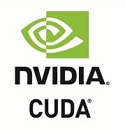

# __`Boost.Python` and `Numba` and `Cython`__
This is a short how-to guide on calling Python function from C++ code using 3 approaches:
1. [__`Boost.Python`__](https://www.boost.org/doc/libs/1_86_0/libs/python/doc/html/index.html)
1. [__`Numba`__](https://numba.pydata.org/)
1. [__`Cython`__]()

Prefer (2) and (3) in low-latency settings.

## Table Of Contents <a name="top"></a>
1. [__Sample Python Program (time_series_analysis.py)__](#sample-python-program-time_series_analysispy)
2. [__`Boost.Python`__](#boostpython)
    - 2.1. [__`Boost.Python` - Python Original Code - `time_series_analysis.py`__](#boostpython---python-original-code---time_series_analysispy)
    - 2.2. [__`Boost.Python` - `time_series_analysis_py/requirements.txt`__](#boostpython---time_series_analysis_pyrequirementstxt)
    - 2.3. [__`Boost.Python` C++ Code Explanation__](#boostpython-c-code-explanation)
    - 2.4. [__`Boost.Python` - `CMakeLists.txt` (Using `FetchContent`)__](#boostpython---cmakeliststxt-using-fetchcontent)
    - 2.5. [__`Boost.Python` - `CMakeLists.txt` (Using `find_package`)__](#boostpython---cmakeliststxt-using-find_package)
    - 2.6. [__`Boost.Python` - `Dockerfile`__](#boostpython---dockerfile)
    - 2.7. [__`Boost.Python` - Solution Directory Structure__](#boostpython---solution-directory-structure)
3. [__`Numba`__](#numba)
    - 3.1. [__`Numba` Python Altered Code - `time_series_analysis_py/time_series_analysis.py`__](#numba-python-altered-code---time_series_analysis_pytime_series_analysispy)
    - 3.2. [__`Numba` - `time_series_analysis_py/requirements.txt`__](#numba---time_series_analysis_pyrequirementstxt)
    - 3.3. [__`Numba` C++ Code Explanation__](#numba-c-code-explanation
    - 3.4. [__`Numba` - `CMakeLists.txt`__](#numba---cmakeliststxt)
    - 3.5. [__`Numba` - `Dockerfile`__](#numba---dockerfile)
    - 3.6. [__`Numba` - Solution Directory Structure__](#numba---solution-directory-structure)
4. [__`Cython`__](#cython)
    - 4.1. [__`Cython` - Python Original Code - `time_series_analysis_py/time_series_analysis.py`__](#cython---python-original-code---time_series_analysis_pytime_series_analysispy)
    - 4.2. [__`Cython` - Cython `.pyx` Code - `time_series_analysis_py/time_series_analysis.pyx`__](#cython---cython-pyx-code---time_series_analysis_pytime_series_analysispyx)
    - 4.3. [__`Cython` - `time_series_analysis_py/requirements.txt`__](#cython---time_series_analysis_pyrequirementstxt)
    - 4.4. [__`Cython` - `time_series_analysis_py/setup.py`__](#cython---time_series_analysis_pysetuppy)
    - 4.5. [__`Cython` - `CMakeLists.txt`__](#cython---cmakeliststxt)
    - 4.6. [__`Cython` - `Dockerfile`__](#cython---dockerfile)
    - 4.7. [__`Cython` - Solution Directory Structure__](#cython---solution-directory-structure)
5. [__Conclusion__](#conclusion)
    - 5.1. [__Why `Numba` and `Cython` should be preferred over `Boost.Python` when low-latency is critical:__](#why-numba-and-cython-should-be-preferred-over-boost-python-when-low-latency-is-critical)
    - 5.2. [__The choice between `Numba` and `Cython`:__](#the-choice-between-numba-and-cython)

<div align="right"><a href="#top" target="_blacnk"></a></div>

## __Sample Python Program (time_series_analysis.py)__
Given the sample python program provided below, our objective is to use the following 3 methods in our C++ program :
- `TimeSeriesAnalysis.is_stationary(...)`
- `TimeSeriesAnalysis.print_adf_test(...)`
- `TimeSeriesAnalysis.print_coint_test(...)`

```python
# time_series_analysis.py
import numpy as np
from typing import Tuple
from statsmodels.tsa.stattools import adfuller, coint

class TimeSeriesAnalysis:
    def __init__(self, x: np.ndarray, y: np.ndarray):
        self.x: np.ndarray = x
        self.y: np.ndarray = y

    def is_stationary(self, significance: float = 0.05) -> bool:
        result: Tuple = adfuller(self.x)
        return result[1] < significance

    def print_adf_test(self, x: np.ndarray) -> None:
        result: Tuple = adfuller(x, maxlag=1, regression='c', autolag=None)
        print(f"ADF Statistic: {result[0]:.5f}")
        print(f"p-value: {result[1]:.5f}")
        print(f"Used Lag: {result[2]}")
        print(f"Number of Observations: {result[3]}")
        print("Critical Values:")
        for key, value in result[4].items():
            print(f"   {key}: {value:.5f}")

    def print_coint_test(self, y0: np.ndarray) -> None:
        result: Tuple = coint(y0, self.y)
        print(f"Cointegration t-statistic: {result[0]:.5f}")
        print(f"p-value: {result[1]:.5f}")
        print(f"Critical Values:")
        for key, value in result[2].items():
            print(f"   {key}: {value:.5f}")

        X: np.ndarray = np.column_stack((y0, np.ones_like(y0)))
        beta: np.ndarray = np.linalg.lstsq(X, self.y, rcond=None)[0]
        print(f"Cointegrating vector: [1, {-beta[0]:.5f}]")
```

<div align="right"><a href="#top" target="_blacnk"></a></div>

## __`Boost.Python`__
[__`Boost.Python`__](https://www.boost.org/doc/libs/1_86_0/libs/python/doc/html/index.html) is a C++ library which enables seamless interoperability between C++ and the Python programming language. The library includes support for:
- References and Pointers
- Globally Registered Type Coercions
- Automatic Cross-Module Type Conversions
- Efficient Function Overloading
- C++ to Python Exception Translation
- Default Arguments
- Keyword Arguments
- Manipulating Python objects in C++
- Exporting C++ Iterators as Python Iterators
- Documentation Strings

<div align="right"><a href="#top" target="_blacnk"></a></div>

### __`Boost.Python` - Python Original Code - `time_series_analysis.py`__
```python
# time_series_analysis.py
import numpy as np
from typing import Tuple
from statsmodels.tsa.stattools import adfuller, coint

class TimeSeriesAnalysis:
    def __init__(self, x: np.ndarray, y: np.ndarray):
        self.x: np.ndarray = x
        self.y: np.ndarray = y

    def is_stationary(self, significance: float = 0.05) -> bool:
        result: Tuple = adfuller(self.x)
        return result[1] < significance

    def print_adf_test(self, x: np.ndarray) -> None:
        result: Tuple = adfuller(x, maxlag=1, regression='c', autolag=None)
        print(f"ADF Statistic: {result[0]:.5f}")
        print(f"p-value: {result[1]:.5f}")
        print(f"Used Lag: {result[2]}")
        print(f"Number of Observations: {result[3]}")
        print("Critical Values:")
        for key, value in result[4].items():
            print(f"   {key}: {value:.5f}")

    def print_coint_test(self, y0: np.ndarray) -> None:
        result: Tuple = coint(y0, self.y)
        print(f"Cointegration t-statistic: {result[0]:.5f}")
        print(f"p-value: {result[1]:.5f}")
        print(f"Critical Values:")
        for key, value in result[2].items():
            print(f"   {key}: {value:.5f}")

        X: np.ndarray = np.column_stack((y0, np.ones_like(y0)))
        beta: np.ndarray = np.linalg.lstsq(X, self.y, rcond=None)[0]
        print(f"Cointegrating vector: [1, {-beta[0]:.5f}]")
```

<div align="right"><a href="#top" target="_blacnk"></a></div>

### __`Boost.Python` - `time_series_analysis_py/requirements.txt`__
```plaintext
numpy
statsmodels
```

<div align="right"><a href="#top" target="_blacnk"></a></div>

### __`Boost.Python` C++ Code Explanation__
1. The line =>
```cpp
py::object module = py::import("time_series_analysis");
```
requires the Python file named time_series_analysis.py to be present in the Python module search path for it to be successfully imported.
  - When you use py::import("time_series_analysis"), __`Boost.Python`__ attempts to locate a Python module named __`time_series_analysis`__ in the directories specified in the Python module search path (which includes the current working directory by default).
  - If the Python file __`time_series_analysis.py`__ is not in the current directory or available in any of the directories in the Python module search path, an error will be raised stating that the module could not be found.
  - Therefore, for the import statement to work correctly, ensure that the __`time_series_analysis.py`__ file is present in the directory where the C++ program is running, or the directory should be in the __Python module search path__.
2. To handle the conversion from __`std::vector<double>`__ to __`np.ndarray`__ in C++ using __`Boost.Python`__, you can invoke the __`NumPy` C API__ within the __C++__ code to create a __NumPy__ array from the __`std::vector<double>`__.
3. The __`from_data`__ function from __`Boost.Python`__'s __NumPy__ module is used to create a __`NumPy`__ array __`np_array`__ from the `std::vector<double>`.
4. To convert the __`std::vector<double>`__ data from the C++ program into __`NumPy`__ arrays to pass as arguments to the Python functions in __`Boost.Python`__, you'll need to utilize the __Boost NumPy library__ __(NOTE: NUMPY SUPPORT INCLUDED DIRECTLY IN BOOST.PYTHON)__ for the conversion.
```cpp
// main.cpp
#include <boost/python.hpp>
#include <boost/python/numpy.hpp>
#include <iostream>
#include <vector>

namespace py = boost::python;
namespace np = boost::python::numpy;

int main() {
    Py_Initialize();
    np::initialize();

    // Import the 'time_series_analysis' module
    py::object module = py::import("time_series_analysis");

    // Get references to the Python functions
    py::object is_stationary = module.attr("is_stationary");
    py::object print_adf_test = module.attr("print_adf_test");
    py::object print_coint_test = module.attr("print_coint_test");

    // Input data as std::vector<double>
    std::vector<double> x = {1, 2, 3, 4, 5, 6, 7, 8, 9, 10};
    std::vector<double> y = {2, 3, 4, 5, 6, 7, 8, 9, 10, 11};

    // Convert std::vector<double> to NumPy arrays
    np::ndarray x_np = np::from_data(x.data(), np::dtype::get_builtin<double>(),
                                     boost::python::make_tuple(x.size()),
                                     boost::python::make_tuple(sizeof(double)),
                                     boost::python::object());
    
    np::ndarray y_np = np::from_data(y.data(), np::dtype::get_builtin<double>(),
                                     boost::python::make_tuple(y.size()),
                                     boost::python::make_tuple(sizeof(double)),
                                     boost::python::object());

    // Call the Python functions with NumPy arrays as arguments
    py::object result_stationary = is_stationary(x_np);
    bool stationary = py::extract<bool>(result_stationary);

    if (stationary) {
        std::cout << "The time series 'x' is stationary." << std::endl;
    } else {
        std::cout << "The time series 'x' is not stationary." << std::endl;
    }

    std::cout << "\nADF Test for x:\n";
    print_adf_test(x_np);

    std::cout << "\nADF Test for y:\n";
    print_adf_test(y_np);

    std::cout << "\nCointegration Test for x and y:\n";
    print_coint_test(x_np, y_np);

    // Shut down the Python interpreter
    Py_Finalize();

    return 0;
}
```

<div align="right"><a href="#top" target="_blacnk"></a></div>

### __`Boost.Python` - `CMakeLists.txt` (Using `FetchContent`)__
```cmake
cmake_minimum_required(VERSION 3.12)
project(CppBoostPython)

set(CMAKE_CXX_STANDARD 11)

include(FetchContent)
FetchContent_Declare(
    BoostPython
    GIT_REPOSITORY https://github.com/matt-42/boost-python.git
    GIT_TAG f22a3833bcc2
)
FetchContent_MakeAvailable(BoostPython)

add_executable(main main.cpp)
target_link_libraries(main PRIVATE Boost::python)
```

<div align="right"><a href="#top" target="_blacnk"></a></div>

### __`Boost.Python` - `CMakeLists.txt` (Using `find_package`)__
```cmake
cmake_minimum_required(VERSION 3.12)
project(CppBoostPython)

set(CMAKE_CXX_STANDARD 11)

find_package(Boost COMPONENTS python REQUIRED)

add_executable(main main.cpp)
target_include_directories(main PRIVATE ${Boost_INCLUDE_DIRS})
target_link_libraries(main PRIVATE ${Boost_LIBRARIES})
```

<div align="right"><a href="#top" target="_blacnk"></a></div>

### __`Boost.Python` - `Dockerfile`__
```dockerfile
# Base image with Python, and necessary packages
FROM python:3.9-slim

## Base image with CMake
#FROM cmake:3.12

# Install Boost (Boost.Python headers) and Python
RUN apt-get update && apt-get install -y \
    python3-dev \
    build-essential \
    libpython3.9 \
    libboost-python-dev \
    cmake

WORKDIR /app

# Copy the project files
COPY . .

# Build the C++ executable using CMake
RUN set -ex; \
    cd /app; \
    ls -latrh ./; \
    pip install --no-cache-dir -r requirements.txt; \
    cmake . && make

CMD ["./main"]
```

<div align="right"><a href="#top" target="_blacnk"></a></div>

### __`Boost.Python` - Solution Directory Structure__
```
Boost_Python_Solution/
├── CMakeLists.txt
├── Dockerfile
├── time_series_analysis.py
└── main.cpp
```

<div align="right"><a href="#top" target="_blacnk"></a></div>

## __`Numba`__
[__`Numba`__](https://numba.pydata.org/) is an open source JIT compiler that translates a subset of Python and NumPy code into fast machine code.
__- Accelerate Python Functions:__
  Numba translates Python functions to optimized machine code at runtime using the industry-standard [LLVM](https://llvm.org/) compiler library. Numba-compiled numerical algorithms in Python can approach the speeds of C or FORTRAN.
  You don't need to replace the Python interpreter, run a separate compilation step, or even have a C/C++ compiler installed. Just apply one of the Numba decorators to your Python function, and Numba does the rest.
__- Built for Scientific Computing:__
  Numba is designed to be used with NumPy arrays and functions. Numba generates specialized code for different array data types and layouts to optimize performance. Special decorators can create [universal functions](https://docs.scipy.org/doc/numpy/reference/ufuncs.html) that broadcast over NumPy arrays just like NumPy functions do.
  Numba also works great with Jupyter notebooks for interactive computing, and with distributed execution frameworks, like Dask and Spark.
__- Parallelize Your Algorithms:__
  Numba offers a range of options for parallelizing your code for CPUs and GPUs, often with only minor code changes.
  __- Simplified Threading:__
  Numba can automatically execute NumPy array expressions on multiple CPU cores and makes it easy to write parallel loops.
  ```python
  @njit(parallel=True)
  def simulator(out):
      # iterate loop in parallel
      for i in prange(out.shape[0]):
        out[i] = run_sim()
  ```
  __- SIMD Vectorization:__
  Numba can automatically translate some loops into vector instructions for 2-4x speed improvements. Numba adapts to your CPU capabilities, whether your CPU supports SSE, AVX, or AVX-512.
  ```python
  LBB0_8:
      vmovups (%rax,%rdx,4), %ymm0
      vmovups (%rcx,%rdx,4), %ymm1
      vsubps  %ymm1, %ymm0, %ymm2
      vaddps  %ymm2, %ymm2, %ymm2
  ```
  __- GPU Acceleration:__
  With support for NVIDIA CUDA, Numba lets you write parallel GPU algorithms entirely from Python.
  

<div align="right"><a href="#top" target="_blacnk"></a></div>

### __`Numba` Python Altered Code - `time_series_analysis_py/time_series_analysis.py`__
```python
# time_series_analysis_py/time_series_analysis.py
import numpy as np
from typing import Tuple
from statsmodels.tsa.stattools import adfuller, coint
from numba import jit

class TimeSeriesAnalysis:
    def __init__(self, x: np.ndarray, y: np.ndarray):
        self.x: np.ndarray = x
        self.y: np.ndarray = y

    @staticmethod
    @jit(nopython=True)
    def _is_stationary(x: np.ndarray, significance: float) -> bool:
        result: Tuple = adfuller(x)
        return result[1] < significance

    def is_stationary(self, significance: float = 0.05) -> bool:
        return self._is_stationary(self.x, significance)

    def print_adf_test(self, x: np.ndarray) -> None:
        result: Tuple = adfuller(x, maxlag=1, regression='c', autolag=None)
        print(f"ADF Statistic: {result[0]:.5f}")
        print(f"p-value: {result[1]:.5f}")
        print(f"Used Lag: {result[2]}")
        print(f"Number of Observations: {result[3]}")
        print("Critical Values:")
        for key, value in result[4].items():
            print(f"   {key}: {value:.5f}")

    def print_coint_test(self, y0: np.ndarray) -> None:
        result: Tuple = coint(y0, self.y)
        print(f"Cointegration t-statistic: {result[0]:.5f}")
        print(f"p-value: {result[1]:.5f}")
        print(f"Critical Values:")
        for key, value in result[2].items():
            print(f"   {key}: {value:.5f}")

        X: np.ndarray = np.column_stack((y0, np.ones_like(y0)))
        beta: np.ndarray = np.linalg.lstsq(X, self.y, rcond=None)[0]
        print(f"Cointegrating vector: [1, {-beta[0]:.5f}]")
```

<div align="right"><a href="#top" target="_blacnk"></a></div>

### __`Numba` - `time_series_analysis_py/requirements.txt`__
```plaintext
numpy
numba
statsmodels
```

<div align="right"><a href="#top" target="_blacnk"></a></div>

### __`Numba` C++ Code Explanation__
```cpp
#include <Python.h>
#include <numpy/arrayobject.h>
#include <vector>
#include <iostream>
#include <fstream>
#include <sstream>

class TimeSeriesAnalysis {
public:
    TimeSeriesAnalysis(const std::vector<double>& x, const std::vector<double>& y) : x_(x), y_(y) {
        Py_Initialize();
        import_array();
        
        // Load the Python module
        PyObject* module_name = PyUnicode_FromString("time_series_analysis_py");
        module_ = PyImport_Import(module_name);
        Py_DECREF(module_name);

        if (module_ == nullptr) {
            PyErr_Print();
            throw std::runtime_error("Failed to load the Python module.");
        }

        // Get the TimeSeriesAnalysis class
        PyObject* tsa_class = PyObject_GetAttrString(module_, "TimeSeriesAnalysis");
        if (tsa_class == nullptr) {
            PyErr_Print();
            throw std::runtime_error("Failed to get TimeSeriesAnalysis class.");
        }

        // Create numpy arrays from C++ vectors
        npy_intp x_dim[] = {static_cast<npy_intp>(x_.size())};
        PyObject* x_array = PyArray_SimpleNewFromData(1, x_dim, NPY_DOUBLE, (void*)x_.data());
        PyObject* y_array = PyArray_SimpleNewFromData(1, x_dim, NPY_DOUBLE, (void*)y_.data());

        // Create an instance of TimeSeriesAnalysis
        tsa_instance_ = PyObject_CallFunction(tsa_class, "OO", x_array, y_array);
        if (tsa_instance_ == nullptr) {
            PyErr_Print();
            throw std::runtime_error("Failed to create TimeSeriesAnalysis instance.");
        }

        Py_DECREF(tsa_class);
        Py_DECREF(x_array);
        Py_DECREF(y_array);
    }

    ~TimeSeriesAnalysis() {
        Py_DECREF(tsa_instance_);
        Py_DECREF(module_);
        Py_Finalize();
    }

    bool is_stationary(double significance = 0.05) {
        PyObject* result = PyObject_CallMethod(tsa_instance_, "is_stationary", "d", significance);
        if (result == nullptr) {
            PyErr_Print();
            throw std::runtime_error("Failed to call is_stationary method.");
        }
        bool is_stationary = PyObject_IsTrue(result);
        Py_DECREF(result);
        return is_stationary;
    }

    void print_adf_test(const std::vector<double>& x) {
        npy_intp size = x.size();
        PyObject* x_array = PyArray_SimpleNewFromData(1, &size, NPY_DOUBLE, (void*)x.data());
        PyObject* result = PyObject_CallMethod(tsa_instance_, "print_adf_test", "O", x_array);
        Py_DECREF(x_array);
        if (result == nullptr) {
            PyErr_Print();
            throw std::runtime_error("Failed to call print_adf_test method.");
        }
        Py_DECREF(result);
    }

    void print_coint_test(const std::vector<double>& y0) {
        npy_intp size = y0.size();
        PyObject* y0_array = PyArray_SimpleNewFromData(1, &size, NPY_DOUBLE, (void*)y0.data());
        PyObject* result = PyObject_CallMethod(tsa_instance_, "print_coint_test", "O", y0_array);
        Py_DECREF(y0_array);
        if (result == nullptr) {
            PyErr_Print();
            throw std::runtime_error("Failed to call print_coint_test method.");
        }
        Py_DECREF(result);
    }

private:
    std::vector<double> x_;
    std::vector<double> y_;
    PyObject* module_;
    PyObject* tsa_instance_;
};

int main() {
    std::vector<double> x = {1, 2, 3, 4, 5, 6, 7, 8, 9, 10};
    std::vector<double> y = {2, 3, 4, 5, 6, 7, 8, 9, 10, 11};

    TimeSeriesAnalysis tsa(x, y);

    bool stationary = tsa.is_stationary();
    std::cout << "The time series 'x' is " << (stationary ? "stationary." : "not stationary.") << std::endl;

    std::cout << "\nADF Test for x:" << std::endl;
    tsa.print_adf_test(x);

    std::cout << "\nADF Test for y:" << std::endl;
    tsa.print_adf_test(y);

    std::cout << "\nCointegration Test for x and y:" << std::endl;
    tsa.print_coint_test(x);

    return 0;
}
```

<div align="right"><a href="#top" target="_blacnk"></a></div>

### __`Numba` - `CMakeLists.txt`__
```CMake
cmake_minimum_required(VERSION 3.12)
project(NumbaCMakeExample)

find_package(Python3 COMPONENTS Interpreter Development NumPy REQUIRED)

include_directories(${Python3_INCLUDE_DIRS} ${Python3_NumPy_INCLUDE_DIRS})

add_executable(main main.cpp)
target_link_libraries(main ${Python3_LIBRARIES})
```

<div align="right"><a href="#top" target="_blacnk"></a></div>

### __`Numba` - `Dockerfile`__
```Dockerfile
# Base image with Python, Numba, and necessary packages
FROM python:3.9-slim

# Install required packages
RUN apt-get update && apt-get install -y \
    python3-dev \
    build-essential \
    libpython3.9 \
    libboost-python-dev \
    cmake

WORKDIR /app

# Copy the project files
COPY . .

# Build the C++ executable using CMake
RUN set -ex; \
    cd /app/time_series_analysis_py; \
    ls -latrh ./; \
    pip install --no-cache-dir -r requirements.txt; \
    cd /app; \
    cmake . && make

CMD ["./main"]
```

<div align="right"><a href="#top" target="_blacnk"></a></div>

### __`Numba` - Solution Directory Structure__
```
Numba_Solution/
│
├── time_series_analysis_py/
│   ├── time_series_analysis.py
│   └── requirements.txt
│
├── main.cpp
├── CMakeLists.txt
└── Dockerfile
```

<div align="right"><a href="#top" target="_blacnk"></a></div>

## __`Cython`__
[__`Cython`__](https://cython.org/) is an __optimising static compiler__ for both the __Python__ programming language and the extended Cython programming language (based on __Pyrex__). It makes writing C extensions for Python as easy as Python itself.

__Cython gives you the combined power of Python and C to let you__
1. write Python code that calls back and forth from and to C or C++ code natively at any point.
1. easily tune readable Python code into plain C performance by adding static type declarations, also in Python syntax.
1. use combined source code level debugging to find bugs in your Python, Cython and C code.
1. interact efficiently with large data sets, e.g. using multi-dimensional NumPy arrays.
1. quickly build your applications within the large, mature and widely used CPython ecosystem.
1. integrate natively with existing code and data from legacy, low-level or high-performance libraries and applications.

The Cython language is a superset of the __Python__ language that additionally supports calling __C functions__ and declaring __C types__ on variables and class attributes. This allows the compiler to generate very __efficient C code__ from Cython code. The __C code__ is generated once and then compiles with all major C/C++ compilers in CPython 2.6, 2.7 (2.4+ with Cython 0.20.x) as well as 3.5 and all later versions.

- [An Introduction to Just Enough Cython to be Useful](https://www.peterbaumgartner.com/blog/intro-to-just-enough-cython-to-be-useful/)

<div align="right"><a href="#top" target="_blacnk"></a></div>

### __`Cython` - Python Original Code - `time_series_analysis_py/time_series_analysis.py`__
```python
# time_series_analysis.py
import numpy as np
from typing import Tuple
from statsmodels.tsa.stattools import adfuller, coint

class TimeSeriesAnalysis:
    def __init__(self, x: np.ndarray, y: np.ndarray):
        self.x: np.ndarray = x
        self.y: np.ndarray = y

    def is_stationary(self, significance: float = 0.05) -> bool:
        result: Tuple = adfuller(self.x)
        return result[1] < significance

    def print_adf_test(self, x: np.ndarray) -> None:
        result: Tuple = adfuller(x, maxlag=1, regression='c', autolag=None)
        print(f"ADF Statistic: {result[0]:.5f}")
        print(f"p-value: {result[1]:.5f}")
        print(f"Used Lag: {result[2]}")
        print(f"Number of Observations: {result[3]}")
        print("Critical Values:")
        for key, value in result[4].items():
            print(f"   {key}: {value:.5f}")

    def print_coint_test(self, y0: np.ndarray) -> None:
        result: Tuple = coint(y0, self.y)
        print(f"Cointegration t-statistic: {result[0]:.5f}")
        print(f"p-value: {result[1]:.5f}")
        print(f"Critical Values:")
        for key, value in result[2].items():
            print(f"   {key}: {value:.5f}")

        X: np.ndarray = np.column_stack((y0, np.ones_like(y0)))
        beta: np.ndarray = np.linalg.lstsq(X, self.y, rcond=None)[0]
        print(f"Cointegrating vector: [1, {-beta[0]:.5f}]")
```

<div align="right"><a href="#top" target="_blacnk"></a></div>

### __`Cython` - Cython `.pyx` Code - `time_series_analysis_py/time_series_analysis.pyx`__
```python
import numpy as np
cimport numpy as np
from typing import Tuple
from statsmodels.tsa.stattools import adfuller, coint

cdef class TimeSeriesAnalysis:
    cdef np.ndarray x
    cdef np.ndarray y

    def __init__(self, np.ndarray[double, ndim=1] x, np.ndarray[double, ndim=1] y):
        self.x = x
        self.y = y

    cpdef bint is_stationary(self, double significance=0.05):
        cdef Tuple result = adfuller(self.x)
        return result[1] < significance

    def print_adf_test(self, np.ndarray[double, ndim=1] x):
        cdef Tuple result = adfuller(x, maxlag=1, regression='c', autolag=None)
        print(f"ADF Statistic: {result[0]:.5f}")
        print(f"p-value: {result[1]:.5f}")
        print(f"Used Lag: {result[2]}")
        print(f"Number of Observations: {result[3]}")
        print("Critical Values:")
        for key, value in result[4].items():
            print(f"   {key}: {value:.5f}")

    def print_coint_test(self, np.ndarray[double, ndim=1] y0):
        cdef Tuple result = coint(y0, self.y)
        print(f"Cointegration t-statistic: {result[0]:.5f}")
        print(f"p-value: {result[1]:.5f}")
        print(f"Critical Values:")
        for key, value in result[2].items():
            print(f"   {key}: {value:.5f}")

        cdef np.ndarray[double, ndim=2] X = np.column_stack((y0, np.ones_like(y0)))
        cdef np.ndarray[double, ndim=1] beta = np.linalg.lstsq(X, self.y, rcond=None)[0]
        print(f"Cointegrating vector: [1, {-beta[0]:.5f}]")
```

<div align="right"><a href="#top" target="_blacnk"></a></div>

### __`Cython` - `time_series_analysis_py/requirements.txt`__
```plaintext
numpy
Cython
statsmodels
```

<div align="right"><a href="#top" target="_blacnk"></a></div>

### __`Cython` - `time_series_analysis_py/setup.py`__
```python
# setup.py
from distutils.core import setup
from Cython.Build import cythonize
import numpy

setup(
    ext_modules=cythonize(
        "time_series_analysis.pyx", compiler_directives={"language_level": "3"}, annotate=True
    ),
    include_dirs=[numpy.get_include()],
)
```

<div align="right"><a href="#top" target="_blacnk"></a></div>

### __`Cython` - `CMakeLists.txt`__
```CMake
cmake_minimum_required(VERSION 3.12)
project(CythonCMakeExample)

find_package(Python3 REQUIRED COMPONENTS Development NumPy)

include_directories(${Python3_INCLUDE_DIRS} ${Python3_NumPy_INCLUDE_DIRS})

add_executable(main main.cpp)
target_link_libraries(main Python3::Python)
```

<div align="right"><a href="#top" target="_blacnk"></a></div>

### __`Cython` - `Dockerfile`__
```Dockerfile
# Base image with Python, Numba, and necessary packages
FROM python:3.9-slim

# Install required packages
RUN apt-get update && apt-get install -y \
    python3-dev \
    build-essential \
    libpython3.9 \
    libboost-python-dev \
    cmake

WORKDIR /app

# Copy the project files
COPY . .

# Build the C++ executable using CMake
RUN set -ex; \
    cd /app/time_series_analysis_py; \
    ls -latrh ./; \
    pip install --no-cache-dir -r requirements.txt; \
    python setup.py build_ext --inplace; \
    cd /app; \
    cmake . && make

CMD ["./main"]
```

<div align="right"><a href="#top" target="_blacnk"></a></div>

### __`Cython` - Solution Directory Structure__
```
Cython_Solution/
│
├── time_series_analysis_py/
│   ├── time_series_analysis.pyx
│   ├── time_series_analysis.py
│   ├── setup.py
│   └── requirements.txt
│
├── main.cpp
├── CMakeLists.txt
└── Dockerfile
```

<div align="right"><a href="#top" target="_blacnk"></a></div>

## __Conclusion__

### __Why `Numba` and `Cython` should be preferred over `Boost.Python` when low-latency is critical:__
In a high-frequency trading (HFT) system where low latency is crucial, directly calling Python functions from C++ using Boost Python may introduce performance overhead due to the inherent inter-language communication. Numba, Cython, and similar alternatives might be more suitable for low-latency requirements in HFT systems. Here are some considerations for each approach:

__1. `Boost.Python`:__
   - Pros:
     - Seamless integration of C++ and Python code.
     - Easy to use for calling Python functions from C++.
   - Cons:
     - Potential performance overhead due to data conversions and inter-language communication.
     - Might not be optimized for ultra-low latency requirements typical in HFT systems.

__2. `Numba`:__
   - Pros:
     - Just-in-time (JIT) compilation of Python code for optimized performance.
     - Supports numerical computations and can be used for accelerating Python functions.
   - Cons:
     - Limited to applying accelerations within the runtime of the Python interpreter.

__3. `Cython`:__
   - Pros:
     - Allows for the creation of C extensions to optimize Python code.
     - Enables the writing of C-like code with Python-like syntax for speed improvements.
   - Cons:
     - Requires manual intervention to annotate and compile the Python code effectively.
     - May have a learning curve for developers unfamiliar with C-oriented programming.

In an HFT system, where every microsecond matters, alternatives like Numba and Cython can provide performance enhancements by compiling Python code to native machine code for faster execution. These tools can help improve the execution speed of numerical computations and algorithms, commonly used in trading systems, without sacrificing performance.

Consider evaluating the specific latency requirements and performance characteristics of your HFT system to determine the best approach for integrating Python functionality into your C++ code while maintaining optimal speed and efficiency.

### __The choice between `Numba` and `Cython`:__
In a high-performance scenario where low latency is crucial for round-trip communication between C++ and Python, both Cython and Numba offer optimizations that can help achieve faster execution speeds. However, the choice between the two typically depends on the specific requirements of your use case:

__1. `Cython`:__
   - Pros:
     - Cython allows you to write C-extension modules that can be seamlessly imported and used in Python.
     - Provides the ability to directly interact with C/C++ libraries, making it well-suited for integrating with existing C++ codebases.
     - Offers extensive optimizations by translating Python code to C code, resulting in potentially faster execution.
     - Allows for fine-grained control over type declarations and optimizations for performance tuning.
   - Cons:
     - Requires manual type annotations and modifications to existing Python code, which can increase development effort.
     - May have a steeper learning curve for developers new to C extensions and Python optimizations.

__2. `Numba`:__
   - Pros:
     - Numba specializes in JIT compilation with a focus on numeric computation, offering automatic optimization of Python functions using LLVM.
     - Provides decorators to accelerate specific Python functions without the need for separate compilation steps.
     - Well-suited for accelerating numerical algorithms and mathematical operations with minimal code changes.
     - Can generate optimized machine code for efficient execution.
   - Cons:
     - Optimizations are limited to the runtime of the Python interpreter, which may not always match the performance of statically compiled C extensions like Cython.
     - May have constraints when working with complex code structures beyond pure numerical computations.

Ultimately, for low-latency round trips between C++ and Python, Cython might be more suitable due to its ability to develop C extensions directly integrating with C++ code, providing fine-grained control over optimizations. However, Numba could also be a viable choice for accelerating numerical computations within Python functions with JIT compilation. It's recommended to benchmark both approaches with your specific use case to determine which one offers the best performance and meets your latency requirements.

<div align="right"><a href="#top" target="_blacnk"></a></div>