# My Notes on Electronic Trading

## Table Of Contents

1. [Understanding the Different Asset Classes](#understanding-the-different-asset-classes)
    - 1.1. [Interest Rates](#interest-rates)
    - 1.2. [Bonds](#bonds)
    - 1.3. [Equities](#equities)
    - 1.4. [Forwards and Futures](#forwards-and-futures)
    - 1.5. [Swaps](#swaps)
    - 1.6. [Options](#options)
2. [Portfolio Risk Management](#portfolio-risk-management)
    - 2.1. [Why do we need portfolio risk management?](#why-do-we-need-portfolio-risk-management)
    - 2.2. [What are performance and risk metrics?](#what-are-performance-and-risk-metrics)
    - 2.3. [Types of performance metrics and their calculation](#types-of-performance-metrics-and-their-calculation)
        - 2.3.1. [Absolute risk-adjusted measures](#absolute-risk-adjusted-measures)
        - 2.3.2. [Relative return measures](#relative-return-measures)
    - 2.4. [Types of risk metrics and their calculations](#types-of-risk-metrics-and-their-calculations)
        - 2.4.1. [Absolute risk measures](#absolute-risk-measures)
        - 2.4.2. [Relative risk measures](#relative-return-measures)
        - 2.4.3. [Tail risk measures](#tail-risk-measures)
    - 2.5. [How to measure trading performance of a portfolio?](#how-to-measure-trading-performance-of-a-portfolio)
    - 2.6. [What is strategy optimisation?](#what-is-strategy-optimisation)
    - 2.7. [An example of strategy optimisation](#an-example-of-strategy-optimisation)

### Understanding the Different Asset Classes
Reviewing superficially the different asset classes. It is just a quick and dirty reminder. Clearly, without a financial background, it surely won’t be enough to understand the rest of the material.

#### Interest Rates

##### __Introduction__

Interest rates represent the amount charged by a lender to a borrower for the use of assets. The amount of money depends on several factors including the credit risk, which is the risk of loss due to the non-payment of the borrower’s duty.

Interest rates are involved to a very large extent in the pricing of all derivatives.

For any given currency, you will find many types of rates. It is essential to apprehend the differences between them. Which rate to use to price this specific financial instrument? What impact in terms of valuation?

That’s the difference between practice and theory. In theory, you just use ‘r’ in your model as being the risk-free interest rate. In practice, you have to ask yourself which specific rate to use as a good proxy for the risk-free interest rate for this particular complex product? And the answer to this question is not always trivial…

Whatever the maturity, interest rates are typically expressed as annual rates, allowing them to be compared easily.

##### __LIBOR and Treasury rates__

###### Treasury rates 

Treasury rates are the rates earned on debt instruments issued by governments. Regulatory issues can impact the value of Treasury rates and cause them to be persistently low. Accordingly, derivatives traders rather use LIBOR as a better proxy for short-term risk-free rates.

###### LIBOR

The London Interbank Offered Rate (LIBOR) is the interest rate at which a bank offers to lend funds to other banks in the interbank market. Depending on the length of deposits, LIBOR rates come in different maturities (overnight, 1w, 1m, 2m, 3m, 6m, 12m) and are associated with all major currencies (EUR, USD, GBP, JPY, CHF).

###### TED Spread

The TED Spread is the difference between 3-month Treasury Bills and 3-month LIBOR. It is often used as a measure of liquidity in the interbank market. Unlike Treasury rates, LIBOR rates involve some credit risk. Therefore the TED spread serves as a measure of credit risk in the interbank market.

<br/>
<div align="right">
    <b><a href="#table-of-contents">⬆️ Back to Top</a></b>
</div>
<br/>

#### Bonds

##### __Introduction__

A bond is a fixed income instrument that represents a loan made by an investor to a borrower. Bonds are used by governments and companies to raise capital. By lending money, the bond’s holder is entitled to receive periodic coupons as well as the initial investment back at the bond’s maturity.

The coupon rate can be fixed or floating. In the first case, the coupon rate is constant throughout the life of the bond while, in the second case, the coupon rate is linked to another index.

Bonds are usually categorized based on their maturities:

- __Short-term:__ maturity less than 2-3 years.
- __Medium-term:__ maturity between 3-4 years and 10 years.
- __Long-term:__ maturity greater than 10 years.

As you can see, this is theoretical and subjective. I might speak about a 2-year bond as a short-term bond while someone else might see it as a medium-term bond. It does not matter. What is relevant for you is to have a sense of what range of maturities are considered as short, medium or long.

##### __Market Price__

As any other financial asset, the market price of a bond is equal to the sum of the present values of its expected cashflows.

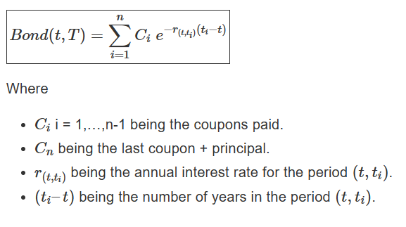

###### Dirty Price

The market price of a bond may include the interest that has accrued since the last coupon date, in which case it is called the dirty price and corresponds to the fair value of a bond as it is the price effectively paid for the bond.

###### Clean Price

Many bond markets quote bonds as clean prices and add accrued interest on explicitely after trading.

##### __Bonds’ underlying risks__

###### Generally safer and more liquid than stocks

Multiple reasons can be put forward to expalin why bonds are generally considered to be a safer investment than stocks. Firstly, bonds are senior to stocks in the firm’s capital structure so that bondholders receive money first in case of an event of default. Then, bonds are generally more liquid than stocks. All in all, bonds are less volatile than stocks and can be used to lower a portfolio’s volatility in times of high volatility in the stock market.

###### But not risk-free

As we can see in the above bond price formula, bond prices are a direct function of interest rates. Since interest rates can vary greatly during the bond’s life, bonds are clearly not risk-free.

###### Interest Rate risk

As a consequence, bonds are subject to interest rate risk. Since the interest rates are used to discount the bond’s coupons, an increase in their value lowers the coupons’ present value, and therefore the bond’s price. The opposite applies in case interest rates go down, in which case the coupons’ present value increase as well as the bond prices.

###### Credit risk

Moreover, bond prices depends on the issuer’s creditworthiness, typically summarized by a rating given by a credit rating agencies (mainly S&P, Moody’s, Fitch). The higher the credit rating, the safer the bond’s issuance, the less the interest rate required by the investor to bear the credit risk, the higher the bond’s price.

###### Inflation risk

Inflation deteriorates the returns associated with bonds. This is particularly true for fixed bonds, which have a set interest rate from inception.

Inflation risk is very insidious as you cannot really see it. You still receive your coupons and principal. Everything seems intact but it really is not. Your purchasing power is suffering slowly but surely.

##### __Zero-Coupon bonds (ZCB)__

ZCB are debt instruments where the lender receives back a principal amount plus interest, only at maturity. No coupon is therefore paid during the bond’s life.

###### Sold at a discount
ZCB are sold at a discount, meaning that its price is lower than 100% of the notional. This is because the interest is deducted up front.

Since no coupon is paid, a ZCB price is nothing but the present value of the par value paid at maturity.

Using continuous compounding to discount cash flows, the price of a ZCB can be expressed as:

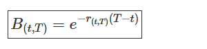

<br/>
<div align="right">
    <b><a href="#table-of-contents">⬆️ Back to Top</a></b>
</div>
<br/>

#### Equities

Companies need cash to operate or finance new projects. They can choose to raise capital by issuing equity.

##### __Dividends__

Companies usually pay their shareholders dividends. Dividends can vary over time depending on the company’s performance and strategy. Dividends can be expressed as discrete dividends or as a continuous equivalent dividend yield, represent by the symbol ‘q’.

For the sake of consistency, I will always use continuous yields for all parameters: interest rates, dividends, borrowing rates, etc..

##### __Repurchase Agreement (Repo)__

If you believe a specific stock price will go down over time, you would be willing to sell it, right?

_But how can you sell something if you don’t own it first?_

Well, you can enter into a repurchase agreement, that is a transaction in which you borrow the stock from another counterparty that actually holds the stock and you agree to give it back at a specific date in the future.

It will allow you to hold the stock and sell it directly. If your intuition about the future stock price going down happens to be correct, you would be able to buy the stock back later at a cheaper price and return it to the lending counterparty, realizing a profit.

_Why would any investor lend me their stocks?_

Some investors do not plan to trade in this stock for a while as they are long-term investors with a buy & hold type of strategy. Repos will benefit these investors by allowing them to earn an additional income paid by the stock borrowers. The borrowing costs are called the repo rate, represented by the symbol ‘b’.

##### __Liquidity__

When trading stocks, an investor should also be vigilant with their liquidity, which is usually quantified by their average daily traded volumes. A stock is said to be liquid if an investor can buy and sell it without moving its price in the market.

Liquidity risk occurs when an investor wants to close his position but is unable to do it quickly enough in the market without impacting the market price. Let say you have a large long position in a stock and want to exit it by selling the stocks, you might not be able to find a buyer quickly enough so that you would have to sell at a lower price than the fair price for the transaction to be conducted. Consequently, you might not be able to make a profit from your investment.

The most popular and crudest measure of liquidity is the bid-ask spread. A narrow bid-ask spread tends to reflect a more liquid market.

<br/>
<div align="right">
    <b><a href="#table-of-contents">⬆️ Back to Top</a></b>
</div>
<br/>

#### Forwards and Futures

Companies need cash to operate or finance new projects. They can choose to raise capital by issuing equity.

##### __Introduction__

A forward contract is an agreement to buy or sell a security at a certain future time for a certain price. The buyer of the forward agrees to pay the price and take delivery of the underlying asset at the pre-determined price on the agreed date.

Forwards are OTC products and are normally not traded on exchanges. However, futures with standardized features are traded on exchanges.

Note that forwards and futures are an obligation and not an option to buy/sell a security at maturity.

##### __Delivery price, Forward price and Forward value__

###### Delivery price

The price specified in a forward contract is called the delivery price. A forward contract is settled at maturity, when the holder of short position delivers the security to the holder of the long position in return for cash amount equal to the delivery price.

###### Forward price

The forward price is defined as the delivery price which would make the forward contract to have zero value.

###### Forward value

The value of a forward contract is determined by the market price of the underlying security.

At inception, the forward and delivery prices are equal and the forward contract has zero value. In other words, it initially costs nothing to enter into a forward contract.

As time passes, the underlying security price changes, causing the forward price and therefore the forward value to change.

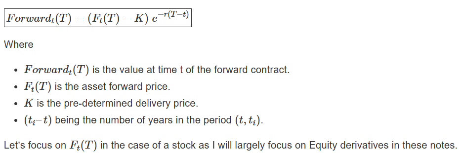

##### __Forward price of a stock__

The forward price of a stock is defined as the fair value of the stock at a specific point of time in the future. It can be viewed as equal to the spot price plus the cost of carrying it.

###### Impact of interest rates

Interest rate increases the cost of carry since the stockholder could have received the interest if he had immediately sold his shares and invested his money in a risk-free investment.

Therefore, the higher the interest rates, the higher the forward price.

###### Impact of dividends and repo

If a stock provides an additional income to the stockholder, this causes the cost of carry to decrease, since the stock also becomes a source of profit. Dividends and stock loans (repos) constitute a source of income when carrying a stock.

Therefore, the higher the dividend yield and the repo rate, the lower the forward price.

The forward price of a stock can be expressed mathematically as follow:

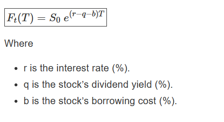

<br/>
<div align="right">
    <b><a href="#table-of-contents">⬆️ Back to Top</a></b>
</div>
<br/>

#### Swaps

##### __Interest Rate Swaps (IRS)__

Interest Rate Swaps (IRS) are over-the-counter (OTC) agreements between two counterparties to swap cashflows in the future.

###### Plain Vanilla Interest Rate Swaps

A plain vanilla interest rate swap is one in which two parties swap a fixed rate of interest and a floating rate. In an IRS, the notional does not actually change hands. Since all cashflows are in the same currency, payments are netted.

The swap’s buyer is the party who agrees to pay the fixed rate and expects the interest rates to rise. The seller of the swap is the party who agrees to receive the fixed rate and expects the interest rates to fall.

###### Basis Swaps

A basis swap is an IRS where a floating rate is swapped for a different floating rate.

###### Value of a Swap

As usual, the swap’s value is nothing but the net present value of all future cashflows, which is equal to the present value from the receiving leg minus the present value from the paying leg.

As with forwards, the terms of a swap contract are defined so that its value at inception is null.

##### __Cross-Currency Swaps (CCS)__

A CCS is a swap in which cash flows are based on different currencies. Unlike an interest rate swap, in a currency swap the notional changes hands both at inception and at the maturity of the swap. Since cashflows are in different currencies, interest payments are also made without netting.

In reality, market participants have different levels of access to funds in different currencies and therefore their funding costs are not always equal to LIBOR.

###### Funding Currency

An approach to work around this is to select one currency as the funding currency, and select one curve in this currency as the discount curve. Cashflows in the funding currency are discounted on this curve. Cashflows in any other currency are first swapped into the funding currency via a cross currency swap and then discounted.

This is something you will often do when working in structured products on a trading floor.

##### __Total Return Swaps (TRS)__

A TRS is a swap agreement in which a party pays fixed or floating interest and receives the total return of an asset. The total return is the sum of the capital gain/loss and any income received during the life of the swap.

The party that receives the total return obviously believes the asset will appreciate.

TRS are a good way to gain exposure to an asset without having to pay additional costs for holding it.

###### Equity Swaps

An equity swap is a particular type of total return swap where the underlying asset can either be an individual stock, a basket of stocks or a stock index.

Unlike stock, you do not have to pay anything up front when entering into an equity swap. Instead, you would usually deposit a margin on which you receive interest. It is therefore a good way to gain exposure to a stock without suffering additional transaction costs and local dividend taxes. It might also be a way of bypassing limitations on leverage.

##### __Dividend Swaps__

A dividend swap is an OTC derivative on a stock, a basket of stocks or a stock index in which two counterparties exchanges cashflows based on the dividends paid by the equity underlying.

The buyer of the swap receives the dividends and pays the fixed payment. The seller of the swap obviously has the opposite position.

While dividend swaps can be used by investors to speculate on future dividends, I rather speak about them as an instrument for traders being long stocks to hedge their dividend risk.

<br/>
<div align="right">
    <b><a href="#table-of-contents">⬆️ Back to Top</a></b>
</div>
<br/>

#### Options

##### Introduction

Options are contracts that give their holder the right, but not the obligation, to either buy or sell an amount of some underlying asset at a pre-determined price at or before a pre-determined date in the future, the maturity date. The maturity of an option could be as short as a day or as long as a couple of years.

While the holder of an option has rights, the seller of an option has the obligation to take the opposite side of the trade if and when the owner exercises his right.

Rights do not come for free. You must therefore pay what is called the premium to buy an option.

##### Call Options

A call option gives its holder the right to buy an underlying asset, a stock for example, at a specific price per share within a specific time frame.

If you sell a call, you have the obligation to sell the stock at a specific price per share within a specific time frame if the call buyer decides to exercise his right to buy the stock at that price.

##### Put Options

A put option gives its holder the right to sell an underlying asset, a stock for example, at a specific price per share within a specific time frame.

If you sell a put, you have the obligation to buy the stock at a specific price per share within a specific time frame if the put buyer decides to exercise his right to sell the stock at that price.

Much of the time, individual calls and puts are not used as a standalone strategy. They can be combined with stock positions and other calls and puts based on the same stock to form more ‘complex’ strategies.

The next module further develops on these vanilla options.

<br/>
<div align="right">
    <b><a href="#table-of-contents">⬆️ Back to Top</a></b>
</div>
<br/>

### Portfolio Risk Management

Performance and risk metrics are widely used to evaluate the performance of a stock or portfolio, and forms a major component of portfolio management. We will try to touch upon some important portfolio and risk metrics that can provide you with a clear view of your investment’s performance and risk.

#### Why do we need portfolio risk management?

The performance of a portfolio of assets is measured with a set of parameters.

For example, if you are trading in equity then your returns are compared against the benchmark index. The consistency of returns of the portfolio also proves to be a significant factor.

But returns alone cannot measure the success or failure of a portfolio. In finance, risk and return are considered to be two sides of the same coin. You can’t have one without the other.

Therefore, identifying and analysing the risk undertaken in your investment is a crucial step while evaluating and optimising your trading strategy.

When asked what the stock market will do, Benjamin Graham said, _“It will fluctuate”_.

There is no sweeping method by which one can predict the exact movement of the market direction. Hence, it is important that we make use of multiple risk and performance metrics while making investment decisions.

#### What are performance and risk metrics?

A key lesson for portfolio risk management is that returns mean nothing unless we put them side by side with the risk undertaken. Performance and risk metrics do just that.

Performance and risk metrics are statistics we use to analyse our trading strategy. They can help determine:

- how well your trading strategy performs,
- how robust it is, and
- if it will survive in different market conditions.

We use these metrics to get a better understanding of an investment's return by measuring how much risk is involved in producing that return.

Let's now look at some useful performance and risk management measures to help you evaluate your investment portfolio.

#### Types of performance metrics and their calculation

The various types of performance metrics are as follows:

- [Absolute risk-adjusted measures](#absolute-risk-measures)
- [Relative return measures](#relative-return-measures)

##### Absolute risk-adjusted measures

###### _Sharpe ratio_

Sharpe Ratio measures the average return earned in excess of the risk-free rate per unit of volatility or total risk i.e., standard deviation.

In other words, the ratio describes how much profit you receive for the extra volatility you endure for holding a riskier asset. Sharpe ratio is one of the most popular metrics among investors to measure portfolio performance.

Remember, you need compensation for the additional risk you take by not holding a risk-free asset.

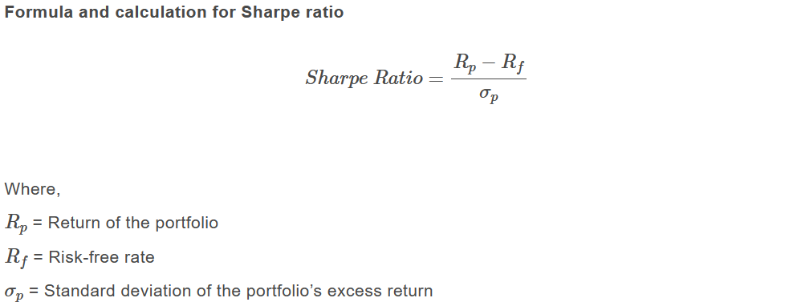

Sharpe ratios greater than 1 are preferable, as it means your returns are greater given the risk you are taking. So generally, the higher the ratio, the better the risk to return scenario for your portfolio.

###### _Sortino ratio_

Sortino ratio is a modified version of the Sharpe ratio that differentiates harmful volatility from the overall volatility. It is calculated by estimating the excess portfolio return over the risk-free return relative to its downside deviation (i.e. standard deviation of negative asset return).

In addition to focusing only on portfolio returns that fall below the mean, the Sortino ratio is thought to offer a better representation of risk-adjusted performance since positive volatility is a benefit. Like Sharpe ratio, a higher value of Sortino ratio indicates less risk relative to return.

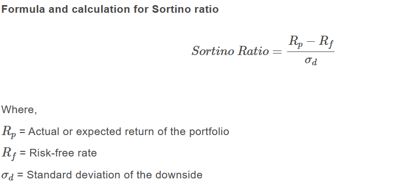

###### _Calmar ratio_

Calmar Ratio also called the Drawdown ratio is calculated as the Average Annual rate of return computed for the latest 3 years divided by the maximum drawdown in the last 36 months.

The higher the ratio, the better is the risk-adjusted performance of an investment fund such as hedge funds or commodity trading advisors (CTAs) in the given time frame of 3 years.

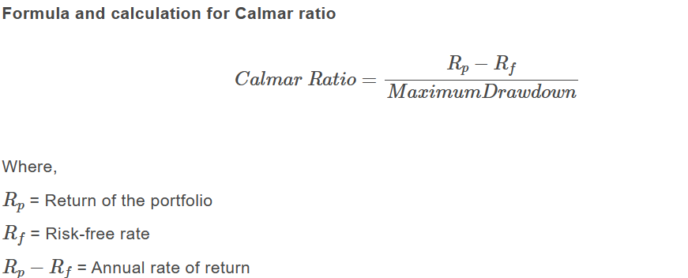

The annual rate of return shows how a fund has performed over a year. The maximum drawdown is characterised as a maximum loss from peak to trough over a given investment period.

It is determined by subtracting the fund’s lowest value from its highest value and then dividing the result by the fund’s peak value.

##### Relative return measures

###### _Up capture ratio_
The Up capture ratio measures a portfolio’s return with respect to the benchmark’s return.

It is used to analyse the performance of a portfolio during bull runs, i.e. when the benchmark has risen. A ratio greater than 100 indicates that the portfolio has outperformed the index.

__Formula for Up capture ratio__

The up capture ratio is calculated by dividing the portfolio’s returns by the returns of the index during the bullish trend and multiplying that factor by 100.

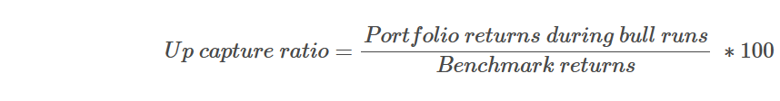

###### _Down capture ratio_

A statistical measure that measures the portfolio’s return with respect to the benchmark’s return.

The downside capture ratio is used to analyse how a portfolio performed during a bearish trend, i.e. when the benchmark has fallen. A ratio less than 100 indicates that the fund has outperformed the index.

__Formula for Down capture ratio__

The down capture ratio is calculated by dividing the portfolio’s returns by the returns of the index during the bearish trend and multiplying that factor by 100.

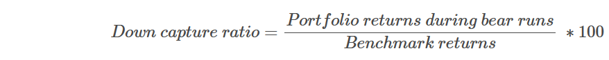

###### _Up percentage ratio_

The Up percentage ratio compares the number of periods a portfolio outperformed the benchmark when the benchmark was up. The higher the ratio the better is the performance of the portfolio.

__Formula for Up percentage ratio__

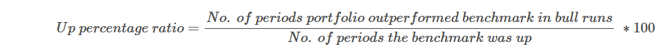

###### _Down percentage ratio_

The Down percentage ratio is a measure of the number of periods that a portfolio outperformed the benchmark when the benchmark was down.

This is then divided by the number of periods that the benchmark was down. The higher the ratio the better is the performance of the portfolio.

__Formula for Down percentage ratio__


```
Down percentage ratio = 
( ( No. of periods portfolio outperformed benchmark in bear runs )
--------
( No. of periods portfolio the benchmark was down ) ) * 100
```

#### Types of risk metrics and their calculations

The types of risk metrics are divided into:

- [Absolute risk measures](#absolute-risk-measures)
- [Relative risk measures](#relative-risk-measures)
- [Tail risk measures](#tail-risk-measures)

##### Absolute risk measures

###### _Variance_

Variance expresses how much the rate of return deviates from the expected return i.e. it indicates the volatility of an asset and hence is considered as a risk indicator.

Therefore, it can be used by the portfolio manager to assess the behaviour of the assets under consideration. A large variance indicates greater volatility in the rate of return.

Formula and calculation for Variance

Variance is calculated as the average of the squared deviations from the mean. To compute variance all you need to do is calculate the difference between each point within the dataset and their mean. Then, square the differences and average the results.

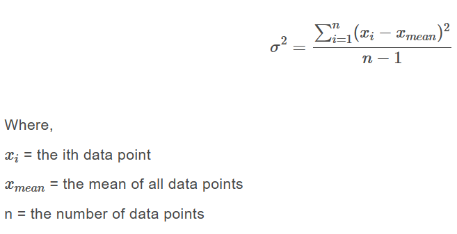

###### _Maximum Drawdown_

Maximum Drawdown is one of the key measures to assess the risk in a portfolio. It indicates the downside risk of a portfolio over a specified time period.

It signifies the maximum loss from a peak to a trough of a portfolio’s equity and is expressed in percentage terms.

A lower maximum drawdown implies slight fluctuations in the value of the investment and, therefore, a lesser degree of  financial risk, and vice versa.

Below you can see a plot of a portfolio’s cumulative returns. Its maximum drawdown, from peak to trough, is represented by the red points as shown.

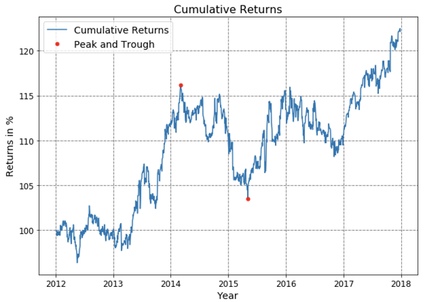

__Formula and calculation for Maximum Drawdown__

Maximum drawdown is given by the difference between the value of the lowest trough and the highest peak before the trough.

It is generally calculated over a long period of time when the value of an asset or an investment has gone through several boom-bust cycles. The formula for calculating Maximum Drawdown is shown below:

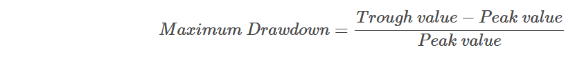

##### Relative risk measures

###### _Correlation Coefficient_

The concept of correlation is really to see if two variables are similar to each other or opposite to each other. The correlation coefficient tells you how strongly any two variables, say x and y, are related.

It takes values only between -1 and 1. A correlation of  -1 means that as x increases, y will decrease. Hence they will move exactly opposite to each other. While a correlation equal to 1 means that as x increases y will also increase.

A correlation of 0 means that x and y have no linear relationship in their movement. The correlation between two variables is particularly helpful when investing in the financial markets.

For example, correlation can help you in determining how well a stock performs relative to its benchmark index, or another fund or asset class. Also, By adding low or negatively correlated assets to your existing portfolio, you can gain diversification benefits.

__Formula and calculation for Correlation Coefficient__

To calculate the correlation coefficient, we must first determine the covariance of the two variables. Next, you should calculate each variable's standard deviation, which is nothing but the square root of the variance.

Now we can find the correlation coefficient. It is determined by dividing the covariance with the product of the two variables' standard deviations. Now, let's look at the formula for covariance and correlation.

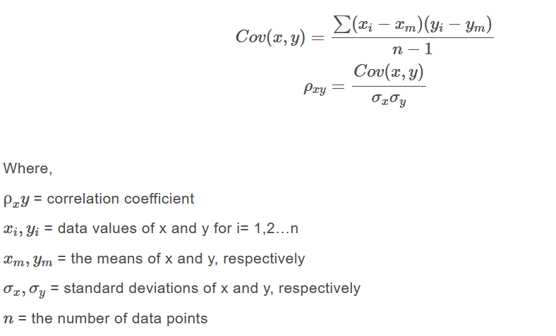

###### _Beta_

Beta measures the volatility of a stock or a portfolio in relation to the market. Beta for the market is always equal to one.

So, if a portfolio has beta greater than 1, it is considered to be more volatile than the market; while a beta less than 1 means less volatility. Beta values are not bounded like the correlation values.

__Formula and calculation for Beta__

To calculate the beta of an asset or portfolio, we must know the covariance between the return of the portfolio and the returns of the market. We will also need the variance of the market returns.

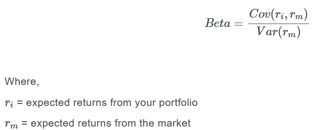

##### Tail risk measures

###### _Value-at-Risk (VaR)_

Value at Risk (VaR) is a statistical measurement used to assess the level of risk associated with a portfolio. The [VaR calculation](https://blog.quantinsti.com/calculating-value-at-risk-in-excel-python/) measures the maximum potential loss with a degree of confidence for a specified period.

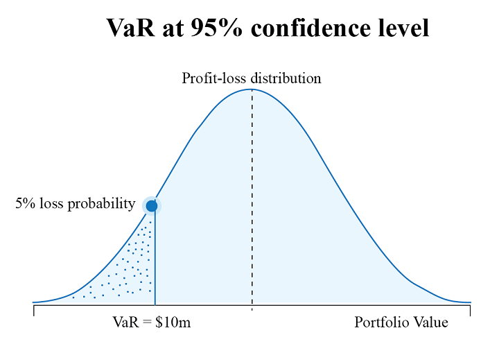

For example, as illustrated above, if the VaR for a portfolio is at 10 million at 95% confidence level, then it means that in 5% of cases the loss will exceed the VaR amount.

However, you should note that VaR does not say anything about the size of the losses within this 5%.

__Formula and calculation for VaR__

There are mainly three methods to calculate VaR. These are the historical method, the variance-covariance method, and the Monte Carlo simulation method. [Value at Risk (VaR) calculations](https://blog.quantinsti.com/calculating-value-at-risk-in-excel-python/) can also be carried out using Excel or Python.

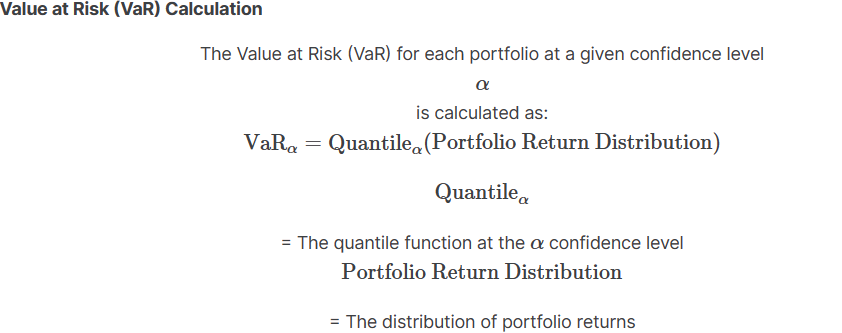

###### _Conditional Value-at-Risk (CVaR)_

Conditional Value-at-Risk, also known as Expected Shortfall (ES), is a risk assessment measure that quantifies the amount of tail risk in an investment portfolio. It is computed by taking a weighted average between the VaR value and the losses exceeding VaR.

As you can see below, CVaR is seen as an extension of VaR and is considered superior to VaR as it accounts for losses exceeding VaR. Therefore, you can use CVaR in your portfolio optimisation strategy to get a better idea of extreme losses and effectively manage your portfolio risk.

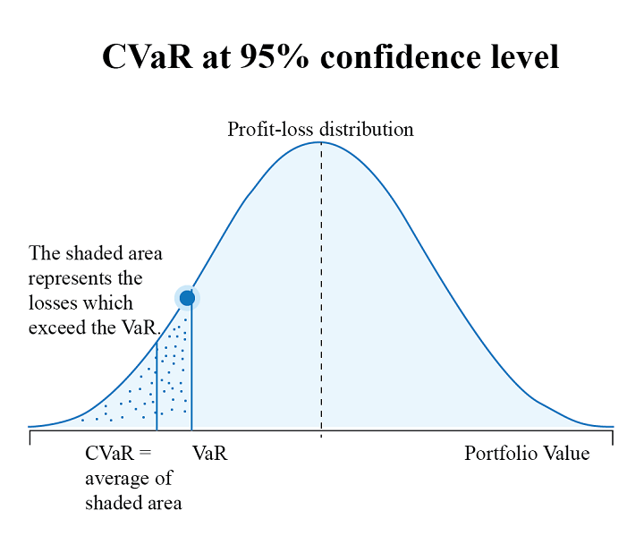

__Formula and calculation for CVaR__

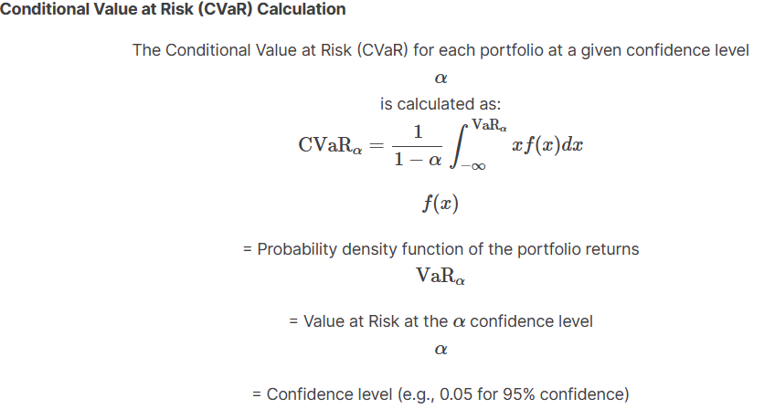

#### How to measure trading performance of a portfolio?

What is the first thing that you look at to gauge the performance of a portfolio? If your answer is high returns, then like most investors, you too think that high returns translate to the excellent performance of a portfolio, but this is only partly true.

While returns do contribute to performance measurement, it is also important to assess the risk undertaken to achieve these returns. Contrary to popular beliefs, the portfolio with the highest returns is not the most ideal portfolio.

To determine the performance of the portfolio, it is necessary to measure the risk-adjusted returns. We have already discussed the various absolute risk-adjusted measures of performance above.

However, it’s also necessary that you understand the various aspects of [portfolio analysis, ie. performance measurement and evaluation](https://blog.quantinsti.com/portfolio-analysis-performance-measurement-evaluation/).

#### What is strategy optimisation?

Let’s say you have developed a strategy and measured its performance and risk metrics.

_How will you know if this strategy garners the best results?_
_And if there is a scope for improvement, wouldn’t you want to make your strategy perform better?_

That’s exactly why the process of strategy optimisation is carried out.
So, you:

- develop a strategy,
- measure its performance,
- optimise it, and
- rebuild on the basis of optimisation.

The optimisation allows a strategist to improve the results of their strategy by fine-tuning the parameters and the formulae that drive the strategy. It can be done by fine-tuning a single parameter or a set of parameters to achieve the desired objective.

An example of a strategy optimisation objective can be maximising the total profits generated. Another objective of optimisation can be minimising the drawdowns.

Having mentioned the purpose of optimisation, one should also be aware that optimisation is like a double-edged sword.

If multiple rules are applied to training data during optimisation to achieve the desired equity curve, it results in over-fitting of the data and the model is likely to lose its forecasting ability on the test and future data.

The portfolio optimisation module is an important component of strategy development platforms. However, one should note that different platforms can offer different strategy optimisation tools and techniques.

Hence, one should evaluate the optimisation tools available before subscribing to any strategy development platform.

#### An example of strategy optimisation

Let us take an example of a simple strategy and use the [“Riskfolio-Lib”](https://riskfolio-lib.readthedocs.io/en/latest/portfolio.html) library to optimise the strategy performance.

Riskfolio-Lib is a Python library specifically designed for portfolio optimisation and allocation. It focuses on four main objectives of optimisation, which include, maximising return, minimising risk, and maximising portfolio utility.

Let’s understand the steps to perform optimisation based on the objective of maximising risk-adjusted returns.

##### _Step 1: Install the library_

The very first step is to install the library. And to do so, you need to run the following code:

```bash
pip install Riskfolio-Lib
```

##### _Step 2: Get the data_

Let’s say we want to optimise a portfolio comprising four stocks: Microsoft, JP Morgan, Comcast, and Target. In that case, we need to first get the price data of these four stocks and then calculate their daily returns. You can do this by running the following lines of code:

```python
import yfinance as yf

# Get the required price data
stocks = ['AAPL', 'TSLA', 'FB', 'MSFT']
price_data = yf.download(stocks, start='2021-04-01', end='2022-03-31')
price_data = price_data.loc[:,'Adj Close']
price_data.columns = stocks

# Calculate returns and drop rows with NaN values
stock_returns = price_data[stocks].pct_change().dropna()
```

##### _Step 3: Create a portfolio and set the method for estimation_

The next step is to create a portfolio and set the method to estimate the required parameters. In this case, it’s expected returns and covariance. We will be carrying out the estimation based on historical data. The following lines of code will help you do this:

```python
import riskfolio as rp

# Create a portfolio
my_portfolio = rp.Portfolio(returns=stock_returns)

# Set the method to estimate expected returns and covariance matrix
# The estimations are based on historical data
my_portfolio.assets_stats(method_mu='hist', method_cov='hist', d=0.94)
```

##### _Step 4: Optimise the portfolio_

Now that we have everything that we need, we can finally optimise the portfolio with this single line of code:

```python
# Optimise the portfolio
stock_weights = my_portfolio.optimization(
    model='Classic', rm='MV', obj='Sharpe', hist=True)*100
```

The model is set to Classic because it’ based on historical data. Alternatively, you can set it to Black Litterman (BL) or Factor Model (FM). The risk measure (rm), in this case, is mean-variance (MV), and the object is Sharpe. We have used historical scenarios for risk measures that depend on scenarios, hence hist is set to “True”.

Output:

```
     Weights(%)
AAPL   75.85
TSLA    0.00
FB     11.45
MSFT   12.70
```

##### _Step 5: Plot the results_

This step is optional. If you wish to visualise the results you can plot them using the same library.

To do so, you need to run the following lines of code:

```python
# Plotting the composition of the portfolio

ax = rp.plot_pie(w=stock_weights/100, title='Sharpe Mean Variance', others=0, nrow=4, cmap="tab20",
                 height=5, width=8, ax=None)
```

Output:

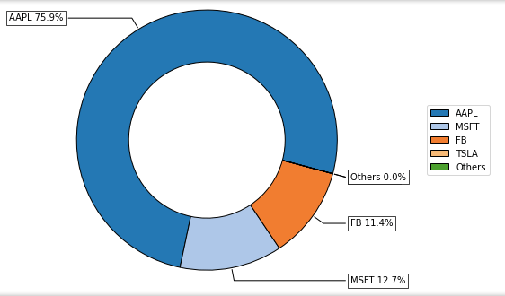

#### Conclusion

Performance metrics are not only used to measure the performance of a portfolio but also to optimise it. In this blog, we have given you an overview of some commonly used portfolio metrics, risk metrics, and also covered the strategy optimisation concept with an example using the “Riskfolio-Lib” library.

A detailed study like this blog on [portfolio optimisation methods](https://blog.quantinsti.com/portfolio-optimization-methods/) compares the performance of an equally-weighted asset portfolio with the performance of an optimised portfolio.

To learn more about building a portfolio quantitatively, strategy optimization, and different portfolio management techniques such as [Factor Investing](https://blog.quantinsti.com/performance-metrics-risk-metrics-optimization/URLs%20https://quantra.quantinsti.com/course/factor-investing-concept-strategies), Risk Parity, Kelly Portfolio, and Modern Portfolio Theory, check out the course on [Quantitative Portfolio Management](https://quantra.quantinsti.com/course/quantitative-portfolio-management?_gl=1*1pucc80*_ga*ODEyNTcxOTQ5LjE3MTI3OTc3OTE.*_ga_SXP1W7WL9G*MTcxMjgwMDUwMy4yLjEuMTcxMjgwMDUyNi4zNy4wLjA.) by Quantra. It is a great way to learn how to construct a portfolio that generates returns and manages risks effectively using risk management metrics.

<br/>
<div align="right">
    <b><a href="#table-of-contents">⬆️ Back to Top</a></b>
</div>
<br/>
